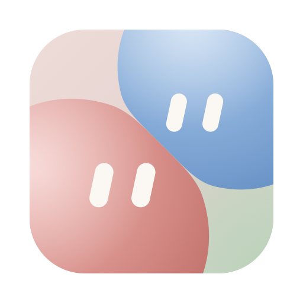
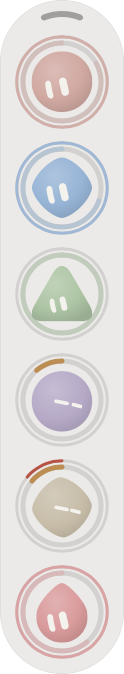

<p align="center"></p>

<h1 align="center">Dango</h1>

<p align="center">Your AI quotas, as a stack of little faces on the edge of your Mac screen.</p>

<p align="center"><a href="README.zh-CN.md">中文</a> · <a href="https://www.liujufu.com/dango/">Website</a> · <a href="https://github.com/Jules-0409/dango/releases/latest">Download</a></p>

---

I pay for several AI coding plans at once, and I kept finding out a plan was empty halfway through a task. So I made Dango: a thin glass capsule that sits on the side of the screen, one ball per plan. When there's plenty left the ball smiles, when it's running low it sulks, and when Dango can't fetch the numbers it cries instead of showing you stale ones.



## Download

**[Dango for macOS (Apple Silicon)](https://github.com/Jules-0409/dango/releases/latest)**, macOS 13 or later.

1. Unzip, then drag `Dango.app` into Applications.
2. Open it. Dango isn't notarized by Apple (I don't have a paid developer account), so the first launch gets blocked. Go to **System Settings → Privacy & Security**, scroll down and click **Open Anyway**. If you'd rather use the terminal:
   ```bash
   xattr -dr com.apple.quarantine /Applications/Dango.app
   ```
3. Want it to start with your Mac? Add it under **System Settings → General → Login Items**.

## Using it

- **Hover** a ball to see its card: every quota window, how much is left, when it resets, and how many tokens you burned today.
- **Poke** a ball. Poke it three times quickly and it gets dizzy; five times and it throws confetti.
- **Drag** the capsule anywhere. It remembers where you left it.
- **Fold** it by clicking the arc at the top; it shrinks into a small pill. Click again to bring the balls back.
- **Settings**: click the Dock icon, or use the menu bar icon → Settings…. The Dock icon only stays around while the settings window is open; close settings and it goes away, leaving just the capsule and the menu bar icon.

What the faces mean:

| Face | Remaining |
|---|---|
| Happy | 60% or more |
| Meh | 15% – 60% |
| Sulking | under 15% |
| Crying, dashed red ring | couldn't fetch (expired login, no network, API changed). The card tells you how to fix it. |

The ring around each ball can be drawn six ways (thin, beads, double, flow, segments, trail). Pick one in Settings.

## What it can read

**Subscriptions**: Claude, Haze, Cursor, Devin, Factory, and Gemini / Antigravity. Dango reads the login each app or CLI already left on your Mac. In Settings → Add a ball, "Log in and add" opens that vendor's own login; Dango never handles the login itself. On first launch it only shows the ones installed on your machine.

**Pay-as-you-go balances**: DeepSeek, Kimi, StepFun, OpenRouter, SiliconFlow. Paste an API key and it asks that vendor's balance endpoint. Set a budget if you want a ring.

**Token ledger**: Settings has a page that adds up tokens per day and per model from local records: Claude Code's session logs, Factory sessions, Devin's local session database, and Cursor's own usage history. Everything is read locally and read-only.

The Gemini ball needs the optional Gemini bridge (`dango-bridge`, see below), which isn't inside the app download.

## Your accounts stay yours

- Other apps' logins are read, never written, and tokens are never refreshed, so your running apps don't get logged out.
- Keys you paste go into the macOS Keychain under Dango's own entry. They're not written to files, not logged, and not sent back to the settings page.
- The control API only listens on `127.0.0.1:8049` and rejects requests from other web pages.
- All the vendor endpoints are unofficial and can change at any time. When parsing fails, Dango shows the error instead of guessing a number.

## Build from source

You need Rust (stable) on macOS.

```bash
git clone https://github.com/Jules-0409/dango.git
cd dango
cargo build --workspace --release
./target/release/dango                # the widget + settings on 127.0.0.1:8049
bash scripts/bundle-macos.sh          # makes dist/Dango.app and a zip
```

| Crate | What it is |
|---|---|
| `dango-widget` | The widget: winit + Core Animation drawing, no WebView for the capsule. Menu bar item, settings window, control API on `127.0.0.1:8049`. |
| `dango-lib` | Shared pieces: data models, Keychain access, per-vendor probes, token ledger. |
| `dango-bridge` | Optional Gemini / Antigravity account-pool bridge on `127.0.0.1:8050`. Add accounts from the settings page. |
| `cursor-bridge` | Optional wrapper that hands requests to the local Cursor CLI agent, on `127.0.0.1:8052`. |
| `grok-ball` | The face renderer, a Rust port of grok-ball.js. |

More detail in [MANUAL.md](MANUAL.md) (Chinese).

## Credits

The emotion-ball engine comes from **[tycoding/grok-ball](https://github.com/tycoding/grok-ball)** (MIT, Copyright (c) 2026 tycoding). `ui/grok-ball.js` is the original; `crates/grok-ball` is a Rust port checked frame by frame against it. The original license is in `crates/grok-ball/LICENSE`.

## License

MIT. `grok-ball` keeps its own MIT license and copyright notice.
