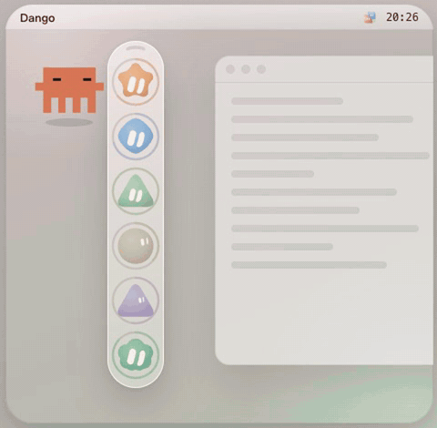

<p align="center"></p>

<h1 align="center">Dango 额度团子</h1>

<p align="center">把 AI 额度做成一串小团子，挂在 Mac 屏幕边上。</p>

<p align="center"><a href="README.md">English</a> · <a href="https://www.liujufu.com/dango/">介绍页</a> · <a href="https://github.com/Jules-0409/dango/releases/latest">下载</a></p>

---

我同时开着好几家 AI 编程的会员，老是写到一半才发现额度没了。所以做了 Dango：屏幕边上一条细细的玻璃胶囊，一颗球是一家。额度多它就笑，快没了就垮脸，查不到就哭，不会拿旧数字糊弄你。

<p align="center"></p>

## 下载

**[Dango for macOS（Apple Silicon）](https://github.com/Jules-0409/dango/releases/latest)**，需要 macOS 13 以上。国内下载慢的话，[介绍页](https://www.liujufu.com/dango/)上有一份同样的包。

1. 解压，把 `Dango.app` 拖进「应用程序」。
2. 打开。因为没有交苹果的开发者年费，App 没做公证，第一次打开会被拦。去 **系统设置 → 隐私与安全性**，往下拉，点 **仍要打开**。习惯用终端的话也可以：
   ```bash
   xattr -dr com.apple.quarantine /Applications/Dango.app
   ```
3. 想开机自己启动：**系统设置 → 通用 → 登录项** 里把 Dango 加进去。

## 怎么用

- **鼠标放到球上**，旁边滑出卡片：每个额度窗口还剩多少、多久重置、今天烧了多少 token。
- **戳它**。连戳三下会晕，戳五下撒花。
- **拖着走**，放哪儿下次还在哪儿。
- **收起来**：点胶囊顶上那道弧，团子一颗颗缩回去，剩一粒小药丸；再点一下又弹出来。
- **设置**：点程序坞里的图标，或者菜单栏图标 →「设置…」。程序坞图标只在设置窗口开着的时候在，关掉设置它就走了，只剩胶囊和菜单栏图标。

表情怎么看：

| 表情 | 还剩 |
|---|---|
| 开心 | 60% 以上 |
| 还行 | 15% – 60% |
| 垮脸 | 不到 15% |
| 哭，外圈红虚线 | 查不到（登录过期、断网、接口改了），卡片里写着怎么修 |

球外面那圈环有六种画法：细环、珠串、双环、流光、分段、尾迹，在设置里挑。

## 能看哪些

**包月的**：Claude、Haze、Cursor、Devin、Factory、DimAgent、Gemini / Antigravity。Dango 读各家 App 或命令行留在你电脑上的登录状态。设置 →「添加小球」里点「登录并添加」，会打开那家自己的登录，Dango 不经手登录。第一次打开时，只挂你电脑上装了的那几家。

**按量付费的余额**：DeepSeek、Kimi、阶跃星辰、OpenRouter、硅基流动。贴上 API Key，它去那家官方的余额接口查；想要一圈环的话填个预算。

**Token 账**：设置里有一页，按天、按模型把本机记录加起来：Claude Code 的会话日志、Factory 的会话、Devin 和 DimAgent 本机的会话库、Cursor 自己的用量明细。都在本机只读。

Gemini 那颗球要配合可选的 Gemini 桥（`dango-bridge`，见下面），下载的 App 里不带它。

## 不碰你的账号

- 别的 App 的登录状态只读不写，也不会帮你刷新 token，免得把你正在用的 App 挤下线。
- 你贴进来的 Key 放在 Mac 钥匙串里 Dango 自己那格，不写文件、不进日志、不回传给页面。
- 控制接口只听 `127.0.0.1:8049`，别的网页发来的请求直接拒掉。
- 各家的接口都是非公开的，随时会变。解析失败就显示错误，不瞎编数字。

## 从源码构建

需要 macOS 和 Rust（stable）。

```bash
git clone https://github.com/Jules-0409/dango.git
cd dango
cargo build --workspace --release
./target/release/dango                # 小件 + 设置页（127.0.0.1:8049）
bash scripts/bundle-macos.sh          # 打出 dist/Dango.app 和 zip
```

| Crate | 是什么 |
|---|---|
| `dango-widget` | 小件本体：winit + Core Animation 直接画，胶囊不用 WebView。菜单栏图标、设置窗口、`127.0.0.1:8049` 控制接口。 |
| `dango-lib` | 共用层：数据模型、钥匙串读写、各家取数探针、Token 账。 |
| `dango-bridge` | 可选的 Gemini / Antigravity 账号池桥（`127.0.0.1:8050`），设置页里一键加账号。 |
| `cursor-bridge` | 可选，把请求交给本机 Cursor CLI Agent 跑（`127.0.0.1:8052`）。 |
| `grok-ball` | 表情球渲染，grok-ball.js 的 Rust 移植。 |

更细的说明在 [MANUAL.md](MANUAL.md)。

## 致谢

表情球引擎来自 **[tycoding/grok-ball](https://github.com/tycoding/grok-ball)**（MIT，Copyright (c) 2026 tycoding）。`ui/grok-ball.js` 是原版，`crates/grok-ball` 是逐帧对照原版移植的 Rust 版，许可证原文在 `crates/grok-ball/LICENSE`。

## License

MIT。`grok-ball` 保留它自己的 MIT 许可证和版权声明。
